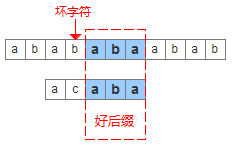
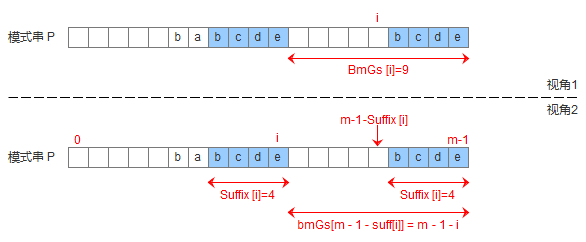
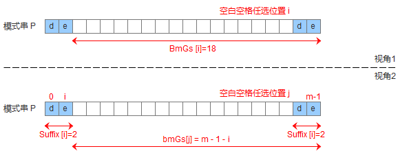
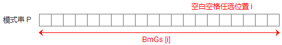

# Boyer-Moore算法(BM算法)

BM算法的基本思想是**通过后缀匹配获得比前缀匹配更多的信息来实现更快的字符跳转。**

后缀匹配，是指**模式串的比较匹配从右到左，模式串的移动是从左到右的匹配过程**。为了更快移动模式串，BM算法定义两个规则：**好后缀规则(good-suffix shift)和坏字符规则(bad-character shift)。**

好后缀和坏字符可以通过下面的图片加深理解：

失配时的移动距离是跟胡坏字符规则和好后缀规则决定出来的。

## 一、坏字符规则(bad-character shift)

**记模式串$pattern$长度为$m$，即末尾字符下标为$(m-1)$，失配字符$x$的下标是$i$。**

坏字符规则是对从后向前匹配过程中遇到的失配字符进行处理的规则，其思想如下：

+ 如果失配字符在模式串$pattern$的失配位置之前没有出现，那么就直接向后移动$(i+1)$位。
+ 如果失配字符在模式串失配位置之前出现过，记出现的左侧距离失配位置最近的下标是$y$，那么需要移动$(x-y)$位。

> 我们可以使用map或者数组(简单的哈希表)来存储每个字符在模式串中最右侧位置距离模式串$pattern$末尾的距离，如果能给定字符集的话，实现起来就会相当方便。

## 二、好后缀规则(good-suffix shift)

好后缀规则是根据失配时已经匹配的子串来进行处理的规则，分成三种情况：

+ **模式串中有子串匹配上好后缀**，此时移动模式串，让该子串和好后缀对齐即可，如果超过一个子串匹配上好后缀，则**选择最靠左边的子串对齐**。

+ 模式串中没有子串匹配上好后缀，**此时需要寻找==模式串的一个最长前缀，并让该前缀等于好后缀的后缀==，寻找到该前缀后，让该前缀和好后缀对齐即可。**

  > 之所以要找前缀，是因为这样可以保证开头是匹配的，如果不是前缀的话，寻找可能开头就不匹配，却又进行一系列没必要的步骤。

+ 模式串中没有子串匹配上好后缀，并且在模式串中找不到最长前缀，此时直接移动模式到好后缀的下一个字符。

为了实现好后缀规则，需要定义一个数组$suffx$，其中$suffix[i]$表示**以$i$下标位置的字符作为右边界，与模式串后缀匹配的最大长度s**，如图所示，公式描述：$S[i-s+1,i]=S[m-s,m-1]=s$。

计算出$suffix$数组之后，我们可以计算$GoodSuf$数组，**$GoodSuf[i]$表示遇到好后缀时，模式串应该移动的距离，==其中$i$表示好后缀前面一个字符的位置，即坏字符的位置==**，构建$GoodSuf$数组分成三种情况，分别对应上面移动模式串的三种情况：

+ 模式串中有子串匹配上好后缀

  

+ 模式串中没有子串匹配上好后缀，但是找到一个最大前缀匹配好后缀的后缀

  

+ 模式串中没有子串匹配上好后缀，也找不到最大前缀匹配好后缀的后缀

  

## 三、失配移动距离

失配时，坏字符规则计算的移动距离为$bad\_char\_move$，好后缀规则计算出的移动距离为$good\_suf\_move$，实际的移动距离为$\max(bad\_char\_move,good\_suf\_move)$。

 **限制于资料的缺乏与目前编程能力尚不够成熟，暂时还没有成功实现BM算法，但是已经掌握了BM算法最重要的部分，因此，以后若有闲暇，我会重新思考如何实现BM算法。**